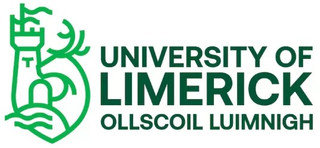
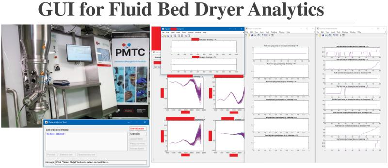
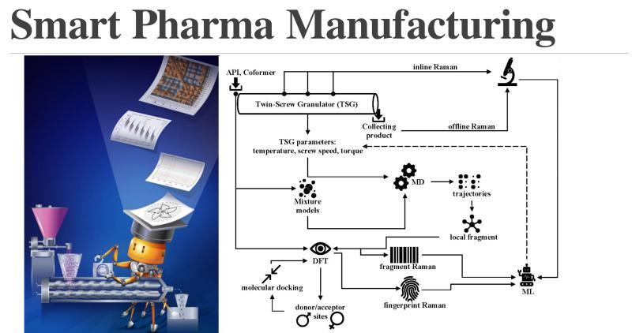
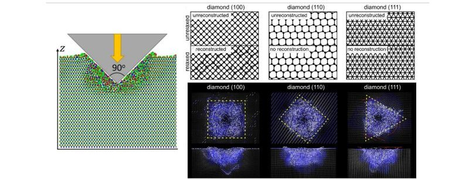
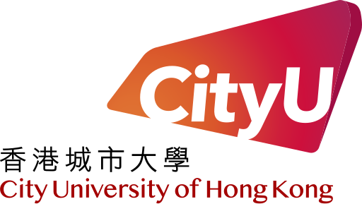
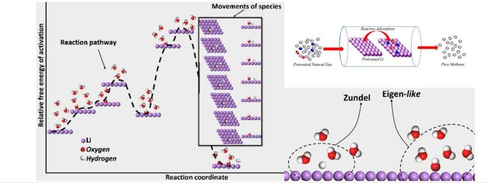

| [PDF](README.pdf) | [Tools](./assets//data-files/tools/)  | Open Topics | Fun Projects | [Private Space](https://github.com/makhsry/Desktop) |
| - | - | - | - | - |
---        

#                    

## Professional Summary       

  

  <strong>details</strong>
  
             
       
 >       
 >          
 > - **A process engineer** holding BASc. & MASc. in **Chemical Engineering** and MASc. in **Mining & Minerals Engineering**, with advanced **data analytics** skills, experienced in **inspecting, designing, optimizing, and evaluating large-scale industrial systems** in conjunction with **simulation, virtual environment training and data-driven** tools to **support design, development, and decision-making** with a focus on **enhancing operational efficiency, identifying potential issues and reducing costs**.         
 > ---        

     

## Organizational Culture      

  

  <strong>details</strong>
  
       

 >       
 >       
 > - **International work experience** across Asia, Europe, Middle East and North America within diverse cultural settings, built and maintained professional relationships.                               
 > - Independent, productive and active **team player**, always met deadlines and delivered projects with high-quality results.       
 > - Skilled in identifying key questions with a root-cause approach, developing clear and compelling argumentation, and crafting effective **project budgets and timelines**.            
 > - Successfully secured **funding** from international organizations including **European Union**.                 
 > - Authored **40+ publications** (h-index: 15) & **spoke at multiple international and national** venues.    
 > ---                          

                      

## Technical Summary        

  

  <strong>details</strong>
  

            
 >        
 >    
 > - **Engineering Tools**                     
 >> Aspen Suite, Aspen Hysys, Aspen Plus, Aspen Dynamics, Autodesk Plant 3D, Deswik, Vulcan, Autodesk AutoCAD, COMSOL, SolidWorks, LAMMPS, VASP, CHARMM, Biovia, Ab Initio, Gromacs, Gaussian, Microsoft Office, LaTeX, Git.           
 >    
 > - **Programming**         
 >> Python, C++, Fortran, Java, MATLAB, bash.                    
 >       
 > - **Modeling Skills**            
 >> - Process Flow Diagrams, Piping and Instrumentation Diagrams, CAD, equipment sizing, cost and utility estimation, exergy and pinch, OpEx and CapEx.                
 >> - Advanced modeling skills across scales:  FEM, DPD, PBM, LBM, QM/MM, MD, DFT, kMC, etc.                
 >> - Data operations including classification, clustering, regression, segmentation, tree models, ensemble learning, temporal data correlation algorithms such as ARIMA, LSTM, CNN, PCA, via PyTorch, SkiLearn, TensorFlow, SQL, Pandas, NumPy, SciPy, Scikit-Learn, Matplotlib, Seaborn, Jupyter.                                        
       
> ---        

## Contact 

  

  <strong>details</strong>
  
               

  >             
  >                                                 
  > - **Email**: miladasgarpour@gmail.com                      
  > - **LinkedIn**: https://www.linkedin.com/in/makhansary                      
  > - **Google Scholar**: https://scholar.google.com/citations?hl=en&user=DZzc424AAAAJ                                                        
  > ---        

   

# Education      

## MASc. Mining and Minerals Engineering (2023 – 2025), <a href="https://www.ubc.ca/">The University of British Columbia</a>  

  

  <strong>details</strong> 
  
 
  
  >            
  >   
  > **Project**     
  >> Microwave assisted drying of minerals, with [Dr. Ali G. Madiseh](https://scholar.google.com/citations?user=37lpUjsAAAAJ&hl=en).
  >
  > **Project Goal**
  >> **Retrofitting of conventional drying unit operations** at a local industrial mining partner.
  >      
  > **Project Summary**
  >> Inspected and evaluated, experimentally and numerically (via Finite Element Modeling in COMSOL), the **feasibility and applicability** of microwave-based heating systems at a local **mining industrial partner** for the **retrofitting of conventional drying unit operations**.
  > 
  > **Tasks Performed**     
  >> - Performed experimental and numerical analysis of **mineral drying behavior under microwave exposure**. 
  >> - Utilized **finite element modeling** (FEM) to simulate heat and mass transfer during drying at various microwave power levels and **mineral types**. 
  >> - Conducted comprehensive **energy demand analysis** to evaluate **potential savings** compared to traditional kiln operations.       
  > ---        

         

## MASc. Chemical Engineering - Process Design (2012 - 2014), <a href="https://ut.ac.ir/en">University of Tehran</a>            

  

  <strong>details</strong> 
  

  >            
  >   
  > **Project** 
  >> Thermo-kinetic modeling of the wet phase inversion process for polymeric membranes fabrication, with [Dr. Mohammad Ali Aroon](https://scholar.google.com/citations?user=IxP_tLUAAAAJ&hl=en).
  >
  > **Project Goal**
  >> Developed a **comprehensive thermo-kinetic model** to simulate the wet phase inversion process for fabricating polymeric membranes, focusing on Multiphysics coupling and accurate prediction of **polymeric flat-sheet membrane structure evolution**.     
  > 
  > **Tasks Performed**   
  >> - Constructed and solved **coupled heat, mass, and momentum transport models under non-equilibrium thermodynamics**, incorporating **moving boundary conditions in multiphase, multicomponent porous systems**.
  >> - Formulated and implemented **partial and ordinary differential equation solvers (PDE/ODE)** to capture the transient dynamics of solvent-nonsolvent exchange and polymer precipitation.
  >> - Wrote custom **code in Fortran, MATLAB, and C++** for high-fidelity numerical simulations and sensitivity analyses.
  >> - **Validated computational results against experimental measurements**, achieving strong agreement in membrane morphology predictions.
  >> - Gained insight into phase separation kinetics, diffusion mechanisms, and the impact of process parameters on membrane performance and structure.        
  >---                                          

    

## BASc. Chemical Engineering (2007 - 2011), <a href="https://ut.ac.ir/en">University of Tehran</a> 

  

  <strong>details</strong>           
  

  >           
  >   
  > **Project**    
  >> Simulation and cost evaluation of hot section of BIPC olefin plant, with [Dr. Nasim Tahouni](https://scholar.google.com/citations?user=jWEhjFcAAAAJ&hl=en).
  >
  > **Project Goal**
  >> Used **Aspen Hysys** and **Aspen Plus** to evaluate **retrofitting** of industrial scale **petroleum refinery** complex by producing process flow diagram (**PFD**), piping/process & instrumentation diagram (**P&ID**), **cost** and **utility**, pinch and exergy.      
  > 
  > **Tasks Performed**       
  >> - Simulated existing and proposed **process configurations using Aspen HYSYS and Aspen Plus**, focusing on optimizing reactor and separation systems for olefin recovery.      
  >> - Developed and **documented detailed Process Flow Diagrams (PFDs) and Piping & Instrumentation Diagrams (P&IDs)** to map unit operations, control loops, and equipment connectivity.
  >> - Performed **equipment sizing and specification** for heat exchangers, reactors, compressors, and distillation columns based on simulated operating conditions.
  >> - Conducted **cost estimation and utility analysis** (CAPEX and OPEX) to support retrofitting and procurement decisions.
  >> - Applied **pinch analysis and exergy analysis** to evaluate and enhance energy integration and thermodynamic efficiency across the system.
  >> - Assessed **retrofitting feasibility** by integrating performance data, economic viability, and process safety considerations.      
  >        
  >>                            
  >---                      

    

# Experience      

## Chemical Process Engineer: Analytics in Fluid Bed Spray Dryer (Research Assistant), <a href="https://www.ul.ie/">University of Limerick</a>, Ireland (2022: Feb - May) 

  

  <strong>details</strong>
  

  >              
  >                 
  > **Project**     
  >> Fluid Bed Spray Dryer Process Monitoring and Engineering, with [Dr. Marcus O'Mahony](https://scholar.google.com/citations?user=zrrZoBkAAAAJ&hl=en).         
  >                     
  > **Project Goal**                
  >> Designed and implemented a **data-driven graphical user interface** for real-time **monitoring** and **optimization** of a fluid bed spray drying process by integrating in-line/offline sensor data streams and advanced analytics into an interactive platform.  
  >                
  > **Tasks Performed**       
  >> - Developed an interactive **graphical user interface (GUI) in MATLAB** for real-time data **visualization** and **diagnostics**, supporting both in-line and offline sensor data integration.                     
  >> - Integrated and processed **diverse sensor types** including CCD camera feeds (image-based analysis), NIR sensors (unlabeled time-series), Raman spectroscopy probes (localized unstructured signals), and valve states (binary control signals).                      
  >> - Performed extensive data preprocessing and cleansing to handle **high-dimensional and heterogeneous datasets** with missing values and sensor noise.                    
  >> - Applied **pattern recognition** and signal analysis techniques to identify operational trends, detect anomalies, and support process optimization.                
  >> - Designed pipelines for real-time data ingestion and synchronization from multiple sensor sources, ensuring temporal alignment and reliable analytics under dynamic plant conditions.                  
  >> - Collaborated with process engineers and control specialists to translate sensor insights into actionable process improvements and control strategies.                       
  >                
  >>                            
  > ---        

        

## Process Engineer: Continuous Crystallization (Marie Sklodowska-Curie Postdoctoral Fellow), <a href="https://www.ul.ie/">University of Limerick</a>, Ireland (2019 - 2022) 

  

  <strong>details</strong>
  

  >         
  >               
  >>  Under an [EU Horizon 2020 Marie Sklodowska-Curie Postdoctoral Fellowship](https://research-and-innovation.ec.europa.eu/funding/funding-opportunities/funding-programmes-and-open-calls/horizon-2020_en).                 
  >>> [Read funding news here.](https://www.ul.ie/news/eu38-million-investment-in-advanced-manufacturing-and-process-engineering-at-ul)             
  >>>                
  >>> [Read outcome highlight here.](https://www.sfi.ie/research-news/news/research-bring-medicines/)                              
  >       
  > **Project**    
  >> Continueous Cocrystalization via Hot Melt Extrusion in Phamaceuticals, with [Dr. Gavin Walker](https://scholar.google.com/citations?user=h4O37BYAAAAJ&hl=en).    
  >
  > **Project Goal**
  >> Developed a **data-driven digital twin framework** to address low-yield challenges in continuous crystallization, aiming to enhance product quality, optimize production, and reduce waste and operational costs in pharmaceutical manufacturing.                       
  > 
  > **Tasks Performed**       
  >> - Conducted detailed **root-cause analysis** of unit operations to identify inefficiencies affecting yield and product purity in **continuous crystallization systems**.                         
  >> - Evaluated the influence of **critical process parameters**—temperature, residence time, screw configuration, and rotation speed—on crystallization outcomes, using both experimental data and simulation insights.                    
  >> - Designed and refined **process strategies*** to maximize desired product formation, suppress by-product generation, and reduce procurement and disposal costs.                      
  >> - Built a digital twin using advanced **data analytics** and implemented a **machine learning-based process controller**, integrating both real-time (in-line) & historical (offline) **sensor data streams**-Raman spectroscopy.                
  >> - Utilized Density Functional Theory (DFT) and molecular dynamics (MD) simulations to analyze **molecular interactions**, guiding optimal cocrystal formation **pathways** and identifying **key process descriptors**.                  
  >> - Integrated **Raman spectrometer** data into a live control system, enabling real-time feedback and control within a continuous manufacturing environment through predictive ML models.                   
  >>                          
  > ---          

        

## Material Engineer: AI & ML (Research Intern), <a href="https://www.skoltech.ru/en/">Skolkovo Institute of Science and Technology (SkolTech)</a>, Russia (2018: May - October) 

  

  <strong>details</strong>            
  

  >         
  >         
  > **Project**    
  >> Machine Learning Interatomic Potentials for Materials Discovery, with [Dr. Alexander Shapeev](https://scholar.google.com/citations?hl=en&user=NMyIbIwAAAAJ).     
  >
  > **Project Goal**              
  >> Aimed to **expedite the discovery and characterization** of hard materials for use in high-performance environments—such as aerospace, automotive, mining, and manufacturing—by developing and deploying **ML-driven interatomic potentials** for predictive modeling.  
  >                     
  > **Tasks Performed**       
  >> - Assessed candidate **hard materials** for industrial applications, focusing on performance under mechanical stress and durability in **extreme conditions**.      
  >> - Conducted **nanoindentation** research to evaluate **mechanical properties** such as hardness and elastic modulus of synthesized materials.        
  >> - Developed validation models to discuss experimental results with simulation predictions, extracting insights into **material failure** modes and defect behavior.       
  >> - Implemented and trained **Machine Learning Interatomic Potentials** (MLIPs) using active learning strategies to improve accuracy with minimal data.       
  >> - **Automated** molecular dynamics (MD) simulations using LAMMPS and density functional theory (DFT) calculations using VASP for large-scale material screening **across multiple HPC clusters**.        
  >> - Wrote modular and efficient code in Python and Bash, managing environments and version control using Git.            
  >>                                                  
  > ---                           

       

## Process Engineer: Gas Separation and Capture (Research Assistant), <a href="https://www.cityu.edu.hk/en">City University of Hong Kong</a>, Hong Kong (2017 - 2018) 

  

  <strong>details</strong>               
  

  >                                     
  >       
  > **Project**    
  >> Design of Adorptive Systems for Direct Gas Capture and Separation, with [Dr. Jin Shang](https://scholar.google.com/citations?user=AWnBD4kAAAAJ).    
  >
  > **Project Goal**
  >> Developed a novel process for the direct capture, separation, and solid-state storage of nitrogen and carbon dioxide gases under ambient conditions using moist lithium as a reactive adsorbent, with an emphasis on circular material recovery for sustainable gas handling and sequestration.                       
  > 
  > **Tasks Performed**       
  >> - Designed and optimized gas capture protocols for ambient-condition adsorption of nitrogen and carbon dioxide on moist lithium, enabling safe and efficient conversion into solid-state lithium nitride for storage and transport.                    
  >> - Applied principles of **reaction engineering** and separation to evaluate process efficiency, yield, and purity of captured products.                 
  >> - Conducted Density Functional Theory (DFT) calculations to map **reaction pathways** between lithium and target gases, identifying favorable thermodynamic and kinetic conditions.                 
  >> - Developed microkinetic and kinetic Monte Carlo models to simulate **reaction dynamics** and **upscale lab-scale findings for process-scale feasibility**.             
  >> - Demonstrated **on-demand recovery** of nitrogen and lithium through electrochemical regeneration, showcasing **material circularity** and long-term process sustainability.                                   
  >>                          
  > ---          

        

## Visiting Researcher, <a href="https://english.iop.cas.cn/">Institute of Physics & Beijing National Lab for Condensed Matter Physics</a>, <a href="https://english.cas.cn/">Chinese Academy of Sciences</a>, Beijing, China (2017: Sept. - Nov.) 

  

  <strong>details</strong>               
  

  >       
  >                                                         
  > with [Dr. Carlos-Andres Palma](https://scholar.google.com/citations?user=HY7q_pcAAAAJ).                      
  >                 
  > **Tasks Performed**       
  >> - Gained hands-on expertise in **CHARMM for (bio)molecular modeling**, focusing on simulation and analysis of organic and biological matter at the atomic level.            
  >> - Developed custom tools in **Fortran** and **Python** for simulation pre-processing and post-analysis, including data parsers, Fourier transforms, and specialized routines for trajectory and energy analysis.                                    
  > ---          

        

## Chemical Engineer: Water Quality Monitoring and Remedition (Research Assistant), <a href="https://enbmsu.info/">Baqiyatallah University of Medical Sciences</a>, Tehran, Iran (2015: Jan. - July)

  

  <strong>details</strong>               
  

  >    
  >                                   
  >> under [Iran National Science Foundation (INSF)](https://insf.org/en).                                                                                      
  > with [Dr. Ramezan Ali Taheri](https://scholar.google.com/citations?user=8GlVKFMAAAAJ).                      
  >                 
  > **Tasks Performed**       
  >> - Thoroughly examined presence of **biologically active matters** in **hospitals wastewater** effluents.                           
  >> - Inspected **wastewater effluent** from hospital sewage to remove biologically active materials, **hormones**, due to their wide use in patient treatments.                     
  >> - Built and performed high-throughput screening of **1k polymers** for common **estrogen**.                   
  >> - Identified relevant pairs and determined the removal capacity and routs accordingly.                                      
  > ---          

  

## Research Collaborator, <a href="https://enbmsu.info/">Islamic Azad University</a>, Tehran, Iran (2014 - 2017)

  

  <strong>details</strong>               
  

  >    
  >                                   
  > with [Young Researchers and Elite Club]().                      
  >                 
  > **Tasks Performed**       
  >> - Managed **diverse portfolios of research and development projects**, ensuring timely delivery, quality outputs, and **cross-disciplinary collaboration**.                    
  >> - Authored technical proposals, project schedules, and successfully acquired research funding for innovative environmental and industrial process solutions.                         
  >> - Directed maintaining high performance across the lifecycle of **multiple concurrent projects**.                           
  >>                                 
  > **Sample Projects**                      
  >> - On-site detection and monitoring of pollutants in **water and wastewater** streams via polymeric passive samplers.                       
  >> - Translated dilation to **attenuated total reflectance Fourier-transform infrared spectroscopy (FTIR-ATR)** of polycarbonate, poly (vinyl acetate), and poly (ether urethane) induced by acetonitrile.                        
  >> - Removal mechanism of **heavy metal ions** (Pb, Cu, Cd, Zn, and Ni) by using lignin as adsorbent.                     
  >> - **Direct air capture and storage** of carbon dioxide (CO2) on biomass and polymers at ambient conditions trough novel 'CO2–water–biomass' network enabling adsorption of 5–56 grams of CO2 per gram of biomass.                           
  >> - Developed a detailed coated paper **process model** including convection, conduction, and radiation heat transfer in order to pave routes for optimization of industrial process through adjustments made to the air humidity, belt velocity, temperatures, as well as the distance between drying surface and the radiation heat source.                              
  >> - **Supercritical fluid extraction and purification** of high end-value products (drugs and dyes) via supercritical carbon dioxide.                                                            
  > ---          

  

## Scientific Computing with MATLAB and C++ (Teacher Assistant), <a href="https://ut.ac.ir/en">University of Tehran</a>, Iran (2009 - 2011)                    

  

  <strong>details</strong>               
  

  >    
  >                                   
  > with [Dr. Mohammad Ali Pourpak]().                      
  >                 
  > **Tasks Performed**       
  >> - Developed **custom numerical algorithms** in **MATLAB** and **C++** to solve complex ordinary and partial differential equations (ODEs/PDEs), and implemented **optimization routines** for scientific and engineering applications.                           
  >> - Applied advanced computational techniques for modeling **physical systems**, performing parameter estimation, and solving **multi-variable optimization problems** with a focus on accuracy, efficiency, and scalability.                                                        
  > ---          

               

