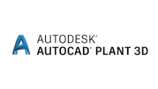
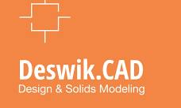
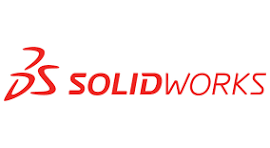
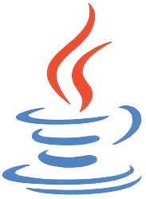
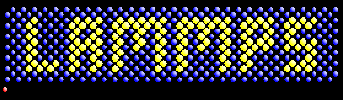

| [PDF version](README.pdf) | [Tools](./assets//data-files/tools/)  | Open Topics | [Private Space](https://github.com/makhsry/Desktop) |
| - | - | - | - |
---        
  

## Introduction

  

  <strong>Professional Summary</strong>
  

       
 >       
 > 
 >> **A process engineer** holding BASc. & MASc. in **Chemical Engineering** and MASc. in **Mining & Minerals Engineering**, with advanced **data analytics** skills, experienced in **inspecting, designing, optimizing, and evaluating large-scale industrial systems** in conjunction with **simulation, virtual environment training and data-driven** tools to **support design, development, and decision-making** with a focus on **enhancing operational efficiency, identifying potential issues and reducing costs**.         
 > ---        
       

  
<strong>Organizational Culture</strong>
       

 >       
 >       
 > - **International work experience** across Asia, Europe, Middle East and North America within diverse cultural settings, built and maintained professional relationships.                               
 > - Independent, productive and active **team player**, always met deadlines and delivered projects with high-quality results.       
 > - Skilled in identifying key questions with a root-cause approach, developing clear and compelling argumentation, and crafting effective **project budgets and timelines**.            
 > - Successfully secured **funding** from international organizations including **European Union**.                 
 > - Authored **40+ publications** (h-index: 15) & **spoke at multiple international and national** venues.    
 > ---        
                             

                      

  

  <strong>Technical Summary</strong>
  

            
 >        
 >    
 > - **Engineering Tools**                     
 >>          
 >    
 > - **Programming**         
 >>         
 >       
 > - **Computational Materials**            
 >>        
> ---        
      

  

  <strong>Places I've been</strong>
  
               
     
  > **Real Life**      
  >>            
  >        
  > **Professional Networks**      
  >>      
  > 
  > **Social Media**                          
  >>    
  >    
  > **Email**      
  >>    
  > ---        
       

        

## Education

  

  <strong>MASc. Mining and Minerals Engineering</strong> (2023 – 2025)  
  

  
  > [The University of British Columbia](https://www.ubc.ca/)
  >   
  > **Project**     
  >> Microwave assisted drying of minerals, with [Dr. Ali G. Madiseh](https://scholar.google.com/citations?user=37lpUjsAAAAJ&hl=en)
  >
  > **Project Goal**
  >> **Retrofitting of conventional drying unit operations** at a local industrial mining partner.
  >      
  > **Project Summary**
  >> Inspected and evaluated, experimentally and numerically (via Finite Element Modeling in COMSOL), the **feasibility and applicability** of microwave-based heating systems at a local **mining industrial partner** for the **retrofitting of conventional drying unit operations**.
  > 
  > **Tasks Performed**     
  >> - Performed experimental and numerical analysis of **mineral drying behavior under microwave exposure**. 
  >> - Utilized **finite element modeling** (FEM) to simulate heat and mass transfer during drying at various microwave power levels and **mineral types**. 
  >> - Conducted comprehensive **energy demand analysis** to evaluate **potential savings** compared to traditional kiln operations.       
  >       
  > **Skills**
  >> Energy Demand Analysis · Exergy & Pinch · COMSOL · FEM analysis · Computational Electromagnetism · Heat Transfer       
  > ---        
  

 

  

  <strong>MASc. Chemical Engineering - Process Design</strong> (2012 - 2014) 
  

  > [University of Tehran](https://ut.ac.ir/en)
  >   
  > **Project** 
  >> Thermo-kinetic modeling of the wet phase inversion process for polymeric membranes fabrication, with [Dr. Mohammad Ali Aroon](https://scholar.google.com/citations?user=IxP_tLUAAAAJ&hl=en)
  >
  > **Project Goal**
  >> Developed a **comprehensive thermo-kinetic model** to simulate the wet phase inversion process for fabricating polymeric membranes, focusing on Multiphysics coupling and accurate prediction of **polymeric flat-sheet membrane structure evolution**.     
  > 
  > **Tasks Performed**   
  >> - Constructed and solved **coupled heat, mass, and momentum transport models under non-equilibrium thermodynamics**, incorporating **moving boundary conditions in multiphase, multicomponent porous systems**.
  >> - Formulated and implemented **partial and ordinary differential equation solvers (PDE/ODE)** to capture the transient dynamics of solvent-nonsolvent exchange and polymer precipitation.
  >> - Wrote custom **code in Fortran, MATLAB, and C++** for high-fidelity numerical simulations and sensitivity analyses.
  >> - **Validated computational results against experimental measurements**, achieving strong agreement in membrane morphology predictions.
  >> - Gained insight into phase separation kinetics, diffusion mechanisms, and the impact of process parameters on membrane performance and structure.
  > 
  > **Skills** 
  >> C++ · Fortran · MATLAB · Transport Phenomena · Numerical Simulation · Mathematical Modeling · Polymer Physics                             
  > ---        
  

    

  

  <strong>BASc. Chemical Engineering</strong> (2007 - 2011) 
  

  > [University of Tehran](https://ut.ac.ir/en)
  >   
  > **Project**    
  >> Simulation and cost evaluation of hot section of BIPC olefin plant, with [Dr. Nasim Tahouni](https://scholar.google.com/citations?user=jWEhjFcAAAAJ&hl=en)
  >
  > **Project Goal**
  >> Used **Aspen Hysys** and **Aspen Plus** to evaluate **retrofitting** of industrial scale **petroleum refinery** complex by producing process flow diagram (**PFD**), piping/process & instrumentation diagram (**P&ID**), **cost** and **utility**, pinch and exergy.      
  > 
  > **Tasks Performed**       
  >> - Simulated existing and proposed **process configurations using Aspen HYSYS and Aspen Plus**, focusing on optimizing reactor and separation systems for olefin recovery.      
  >> - Developed and **documented detailed Process Flow Diagrams (PFDs) and Piping & Instrumentation Diagrams (P&IDs)** to map unit operations, control loops, and equipment connectivity.
  >> - Performed **equipment sizing and specification** for heat exchangers, reactors, compressors, and distillation columns based on simulated operating conditions.
  >> - Conducted **cost estimation and utility analysis** (CAPEX and OPEX) to support retrofitting and procurement decisions.
  >> - Applied **pinch analysis and exergy analysis** to evaluate and enhance energy integration and thermodynamic efficiency across the system.
  >> - Assessed **retrofitting feasibility** by integrating performance data, economic viability, and process safety considerations.    
  >      
  > **Skills**
  >> Aspen HYSYS · Aspen Plus · Aspen Dynamics · Chemical Engineering · Process Simulation · Cost-Benefit Analysis · Exergy                               
  > ---        
  

    

## Experience

  

  <strong>Chemical Process Engineer: Analytics in Fluid Bed Spray Dryer (Research Assistant), University of Limerick, Ireland</strong> (2022: Feb - May) 
  

  > [University of Limerick](https://www.ul.ie/)               
  >         
  > **Project**    
  >> Fluid Bed Spray Dryer Process Monitoring and Engineering, with [Dr. Marcus O'Mahony](https://scholar.google.com/citations?user=zrrZoBkAAAAJ&hl=en).     
  >
  > **Project Goal**
  >> Designed and implemented a **data-driven graphical user interface** for real-time **monitoring** and **optimization** of a fluid bed spray drying process by integrating in-line/offline sensor data streams and advanced analytics into an interactive platform.  
  > 
  > **Tasks Performed**       
  >> - Developed an interactive **graphical user interface (GUI) in MATLAB** for real-time data **visualization** and **diagnostics**, supporting both in-line and offline sensor data integration.                     
  >> - Integrated and processed **diverse sensor types** including CCD camera feeds (image-based analysis), NIR sensors (unlabeled time-series), Raman spectroscopy probes (localized unstructured signals), and valve states (binary control signals).                      
  >> - Performed extensive data preprocessing and cleansing to handle **high-dimensional and heterogeneous datasets** with missing values and sensor noise.                    
  >> - Applied **pattern recognition** and signal analysis techniques to identify operational trends, detect anomalies, and support process optimization.                
  >> - Designed pipelines for real-time data ingestion and synchronization from multiple sensor sources, ensuring temporal alignment and reliable analytics under dynamic plant conditions.                  
  >> - Collaborated with process engineers and control specialists to translate sensor insights into actionable process improvements and control strategies.
  > **Skills**
  >> Data Analytics · Machine Learning · Data-Driven Process Control · Graphical User Interface · MATLAB · Python       
  >                
  >>                            
  > ---        
                                

        

  

  <strong>Process Engineer: Continuous Crystallization (Marie Sklodowska-Curie Postdoctoral Fellow), University of Limerick, Ireland</strong> (2019 - 2022) 
  

  > [University of Limerick](https://www.ul.ie/)
  >   
  >>  Under an [EU Horizon 2020 Marie Sklodowska-Curie Postdoctoral Fellowship](https://research-and-innovation.ec.europa.eu/funding/funding-opportunities/funding-programmes-and-open-calls/horizon-2020_en).                 
  >>> [Read news here.](https://www.ul.ie/news/eu38-million-investment-in-advanced-manufacturing-and-process-engineering-at-ul)                                
  >       
  > **Project**    
  >> Continueous Cocrystalization via Hot Melt Extrusion in Phamaceuticals, with [Dr. Gavin Walker](https://scholar.google.com/citations?user=h4O37BYAAAAJ&hl=en).    
  >
  > **Project Goal**
  >> Developed a **data-driven digital twin framework** to address low-yield challenges in continuous crystallization, aiming to enhance product quality, optimize production, and reduce waste and operational costs in pharmaceutical manufacturing.                       
  > 
  > **Tasks Performed**       
  >> - Conducted detailed **root-cause analysis** of unit operations to identify inefficiencies affecting yield and product purity in **continuous crystallization systems**.                         
  >> - Evaluated the influence of **critical process parameters**—temperature, residence time, screw configuration, and rotation speed—on crystallization outcomes, using both experimental data and simulation insights.                    
  >> - Designed and refined **process strategies*** to maximize desired product formation, suppress by-product generation, and reduce procurement and disposal costs.                      
  >> - Built a digital twin using advanced **data analytics** and implemented a **machine learning-based process controller**, integrating both real-time (in-line) & historical (offline) **sensor data streams**-Raman spectroscopy.                
  >> - Utilized Density Functional Theory (DFT) and molecular dynamics (MD) simulations to analyze **molecular interactions**, guiding optimal cocrystal formation **pathways** and identifying **key process descriptors**.                  
  >> - Integrated **Raman spectrometer** data into a live control system, enabling real-time feedback and control within a continuous manufacturing environment through predictive ML models.                
  >          
  > **Skills**
  >> Process Simulation · Molecular Dynamics · Density Functional Theory · Raman Spectroscopy · Machine Learning   
  >                  
  >>                          
  > ---        
                           

        

  

  <strong>Material Engineer: AI & ML (Research Intern), Skolkovo Institute of Science and Technology (SkolTech), Russia</strong> (2018: May - October) 
  

  > [Skolkovo Institute of Science and Technology (SkolTech)](https://www.skoltech.ru/en/)    
  >         
  > **Project**    
  >> Machine Learning Interatomic Potentials for Materials Discovery, with [Dr. Alexander Shapeev](https://scholar.google.com/citations?hl=en&user=NMyIbIwAAAAJ).     
  >
  > **Project Goal**
  >> Aimed to **expedite the discovery and characterization** of hard materials for use in high-performance environments—such as aerospace, automotive, mining, and manufacturing—by developing and deploying **ML-driven interatomic potentials** for predictive modeling.  
  > 
  > **Tasks Performed**       
  >> - Assessed candidate **hard materials** for industrial applications, focusing on performance under mechanical stress and durability in **extreme conditions**.      
  >> - Conducted **nanoindentation** research to evaluate **mechanical properties** such as hardness and elastic modulus of synthesized materials.        
  >> - Developed validation models to discuss experimental results with simulation predictions, extracting insights into **material failure** modes and defect behavior.       
  >> - Implemented and trained **Machine Learning Interatomic Potentials** (MLIPs) using active learning strategies to improve accuracy with minimal data.       
  >> - **Automated** molecular dynamics (MD) simulations using LAMMPS and density functional theory (DFT) calculations using VASP for large-scale material screening **across multiple HPC clusters**.        
  >> - Wrote modular and efficient code in Python and Bash, managing environments and version control using Git.          
  >        
  > **Skills**
  >> Machine Learning · Molecular Dynamics · Density Functional Theory Calculations · Python · bash                          
  >                
  >>                                                  
  > ---        
                           

       

