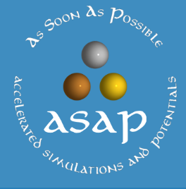

  
<strong>Professional Summary</strong>

       
 >       
 > 
 > **A process engineer** holding BASc. & MASc. in **Chemical Engineering** and MASc. in **Mining & Minerals Engineering**, with advanced **data analytics** skills, experienced in **inspecting, designing, optimizing, and evaluating large-scale industrial systems** in conjunction with **simulation, virtual environment training and data-driven** tools to **support design, development, and decision-making** with a focus on **enhancing operational efficiency, identifying potential issues and reducing costs**.     
 >     

  
<strong>Organizational Culture</strong>
       

 >       
 >       
 > - **International work experience** across Asia, Europe, Middle East and North America within diverse cultural settings, built and maintained professional relationships.                               
 > - Independent, productive and active **team player**, always met deadlines and delivered projects with high-quality results.       
 > - Skilled in identifying key questions with a root-cause approach, developing clear and compelling argumentation, and crafting effective **project budgets and timelines**.            
 > - Successfully secured **funding** from international organizations including **European Union**.                 
 > - Authored **40+ publications** (h-index: 15) & **spoke at multiple international and national** venues.                               

                      

  

  <strong>Technical Summary</strong>
  

            
 >        
 >    
 > - **Engineering Tools**                     
 >>          
 >    
 > - **Programming**         
 >>         
 >       
 > - **Computational Materials**            
 >>        
>       

  

  <strong>Places I've been</strong>
  
               
     
  > **Social Media**      
  >>      
  > 
  >>    
  >        
  >>        
 > **Real Life**      
  >>            

        

  

  <strong>MASc. Mining and Minerals Engineering</strong> (2023 – 2025)  
  

  
  > [The University of British Columbia](https://www.ubc.ca/)
  >   
  > **Project**     
  >> Microwave assisted drying of minerals, with [Dr. Ali G. Madiseh](https://scholar.google.com/citations?user=37lpUjsAAAAJ&hl=en)
  >
  > **Project Goal**
  >> **Retrofitting of conventional drying unit operations** at a local industrial mining partner.
  >      
  > **Project Summary**
  >> Inspected and evaluated, experimentally and numerically (via Finite Element Modeling in COMSOL), the **feasibility and applicability** of microwave-based heating systems at a local **mining industrial partner** for the **retrofitting of conventional drying unit operations**.
  > 
  > **Tasks Performed**     
  >> - Performed experimental and numerical analysis of **mineral drying behavior under microwave exposure**. 
  >> - Utilized **finite element modeling** (FEM) to simulate heat and mass transfer during drying at various microwave power levels and **mineral types**. 
  >> - Conducted comprehensive **energy demand analysis** to evaluate **potential savings** compared to traditional kiln operations.       
  >       
  > **Skills**
  >> Energy Demand Analysis · Exergy & Pinch · COMSOL · FEM analysis · Computational Electromagnetism · Heat Transfer       

 

  

  <strong>MASc. Chemical Engineering - Process Design</strong> (2012 - 2014) 
  

  > [University of Tehran](https://ut.ac.ir/en)
  >   
  > **Project** 
  >> Thermo-kinetic modeling of the wet phase inversion process for polymeric membranes fabrication, with [Dr. Mohammad Ali Aroon](https://scholar.google.com/citations?user=IxP_tLUAAAAJ&hl=en)
  >
  > **Project Goal**
  >> Developed a **comprehensive thermo-kinetic model** to simulate the wet phase inversion process for fabricating polymeric membranes, focusing on Multiphysics coupling and accurate prediction of **polymeric flat-sheet membrane structure evolution**.     
  > 
  > **Tasks Performed**   
  >> - Constructed and solved **coupled heat, mass, and momentum transport models under non-equilibrium thermodynamics**, incorporating **moving boundary conditions in multiphase, multicomponent porous systems**.
  >> - Formulated and implemented **partial and ordinary differential equation solvers (PDE/ODE)** to capture the transient dynamics of solvent-nonsolvent exchange and polymer precipitation.
  >> - Wrote custom **code in Fortran, MATLAB, and C++** for high-fidelity numerical simulations and sensitivity analyses.
  >> - **Validated computational results against experimental measurements**, achieving strong agreement in membrane morphology predictions.
  >> - Gained insight into phase separation kinetics, diffusion mechanisms, and the impact of process parameters on membrane performance and structure.
  > 
  > **Skills** 
  >> C++ · Fortran · MATLAB · Transport Phenomena · Numerical Simulation · Mathematical Modeling · Polymer Physics                             

    

  

  <strong>BASc. Chemical Engineering</strong> (2007 - 2011) 
  

  > [University of Tehran](https://ut.ac.ir/en)
  >   
  > **Project**    
  >> Simulation and cost evaluation of hot section of BIPC olefin plant, with [Dr. Nasim Tahouni](https://scholar.google.com/citations?user=jWEhjFcAAAAJ&hl=en)
  >
  > **Project Goal**
  >> Used **Aspen Hysys** and **Aspen Plus** to evaluate **retrofitting** of industrial scale **petroleum refinery** complex by producing process flow diagram (**PFD**), piping/process & instrumentation diagram (**P&ID**), **cost** and **utility**, pinch and exergy.      
  > 
  > **Tasks Performed**       
  >> - Simulated existing and proposed **process configurations using Aspen HYSYS and Aspen Plus**, focusing on optimizing reactor and separation systems for olefin recovery.      
  >> - Developed and **documented detailed Process Flow Diagrams (PFDs) and Piping & Instrumentation Diagrams (P&IDs)** to map unit operations, control loops, and equipment connectivity.
  >> - Performed **equipment sizing and specification** for heat exchangers, reactors, compressors, and distillation columns based on simulated operating conditions.
  >> - Conducted **cost estimation and utility analysis** (CAPEX and OPEX) to support retrofitting and procurement decisions.
  >> - Applied **pinch analysis and exergy analysis** to evaluate and enhance energy integration and thermodynamic efficiency across the system.
  >> - Assessed **retrofitting feasibility** by integrating performance data, economic viability, and process safety considerations.    
  >      
  > **Skills**
  >> Aspen HYSYS · Aspen Plus · Aspen Dynamics · Chemical Engineering · Process Simulation · Cost-Benefit Analysis · Exergy                               

    

