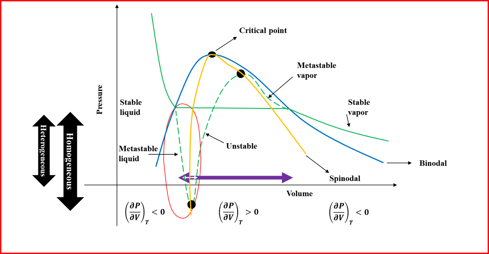
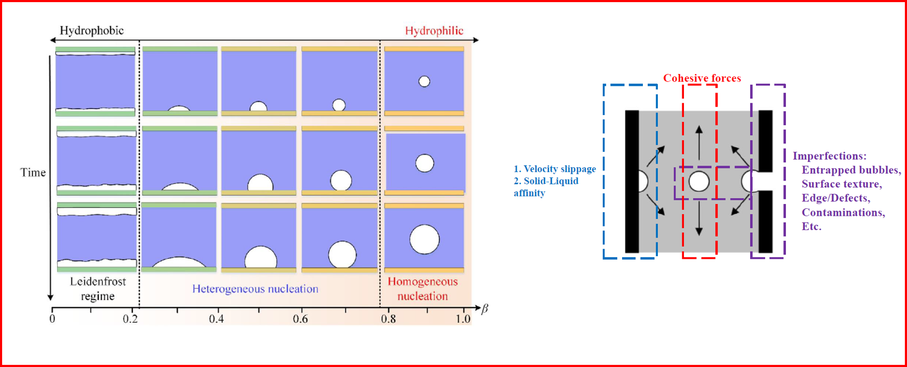

# Destructive Force of a Collapsing Cavitation Bubble: the State of Pistol Shrimp

details
         

**Keywords**: cavitation; bubble formation; surface physics; thermophysical properties

## Main      
The pistol shrimp (Alpheidae) is a marine crustacean renowned for its extraordinarily fast and powerful striking appendages, which primarily used for hunting, defense, and communication [@10_dot_1038_slash_428819a]. These shrimps generate high peak forces over very short time periods, where a key element in the striking power, particularly underwater, is the phenomenon of cavitation—the formation and rapid collapse of vapor bubbles due to swift appendage movement [@10_dot_1126_slash_science_dot_289_dot_5487_dot_211]. The extremely rapid closure of snapper claw emits a high_velocity water jet with speeds exceeding 32 m/s, leading to pressure drops of ~3×105 Pa, which is enough to vaporize water locally [@10_dot_1038_slash_s41598_017_14312_0], [@10_dot_1371_slash_journal_dot_pone_dot_0077120], [@10_dot_1038_slash_35097152]. In the low_pressure region behind the jet, cavitating bubbles form and then violently collapses.  

The physical heterogeneities – which are comprised of change in the texture of the surface or the presence of contractions/expansions – can initiate bubble formation and nucleation [@10_dot_1021_slash_acs_dot_langmuir_dot_7b02027], [@10_dot_1021_slash_la403733a], [@10_dot_1039_slash_C5SM02794B]. The surface roughness can be defined as the ratio of minimum hydraulic radius to maximum hydraulic radius [@10_dot_1029_slash_2019WR025170], and when roughness is larger than 6%, hydrophilic confinements may cause cavitation by increasing the possibility of bubble entrapment at physical heterogeneities as such irregularities resulting in different local liquid pressures. For irregularities in the form of corners, cavitation can occur due to the corner flow of liquid [@10_dot_1021_slash_acs_dot_langmuir_dot_7b02027], especially when the equivalent radius of confinement is smaller than 115 nanometers. For irregularities in the form of expansion/contraction, bubble entrapment at the air–water interface at the confinement entrance can occur which then can move deep into the confinement in the direction of the contraction [@10_dot_1073_slash_pnas_dot_101407510], [@10_dot_1021_dot_jp2068304], [@10_dot_1021_dot_la104279v], [@10_dot_1021_dot_jp4002912].  

The chemical heterogeneities of the surface in contact with liquid can influence the position and shape of initial bubbles, where nucleation will occur around the less hydrophilic regions [@10_dot_1029_slash_2019WR025170], [@10_dot_1038_slash_s41565_017_0031_9]. Furthermore, the affinity of the surface towards the liquid may cause layering of the liquid. For example, a surface fully made of carbon (hydrophobic) would repel water molecules while a surface containing nitrogen (hydrophilic) attracts water molecules [@10_dot_1038_slash_s41565_017_0031_9], [@10_dot_1021_dot_acsnano_dot_2c02784], [@10_dot_1103_slash_PhysRevLett_dot_102_dot_184502], [@10_dot_1063_slash_1_dot_3697977]. Near a hydrophilic surface, several layers are identified for monoatomic and polymeric fluids while the density profile far from the surface remains smooth [@10_dot_1103_slash_PhysRevLett_dot_86_dot_803]. In the case of water, the first water layer adjacent to the surface is locked where each oxygen–surface bond is followed with a hydrogen–surface bond (known as flat ice). The affinity of the surface determines the thickness of this first layer. The remaining water molecules interact with this first layer and experience oscillations in velocity. The higher the affinity of the surface, the higher are the velocity oscillations. Such velocity oscillations can drastically increase if molecules are trapped inside a narrow confinement of size $15\times\sigma$, where $\sigma$ is the distance where the attractive and the repulsive forces of the surface equilibrate. These drastic velocity oscillations may expose water to high shear stresses and, if strong enough, can initiate bubble formation by breaking the cohesion between the water molecules. In fact, the more hydrophilic the surface, the greater is the energy barrier for bubble formation and nucleation. In contrast, in a hydrophobic confinement, bubble formation is almost inevitable. This is because a hydrophobic surface significantly reduces, or even eliminates, the energy required for bubble formation and nucleation [@10_dot_1061_slash_openpar_ASCE_closepar_GT_dot_1943_5606_dot_0002598]. 
We use molecular modeling to probe this cavitation computationally. This choice is because the continuum and mesoscale approaches that rely on the Navier_Stokes theory cannot be considered since they fail when the geometry/size of system is less than 5.1 times the molecular diameter of liquid [@10_dot_1103_slash_PhysRevE_dot_55_dot_4288], [@10_dot_1063_slash_1_dot_480758], [@10_dot_1016_slash_S0378_4371_openpar_97_closepar_00155_6]. The geometry of shrimp claw and simulation extend is shown in FIGURE and implemented in LAMMPS. To reflect hydrophobicity/hydrophilicity of surfaces, an implicit approach is used since it significantly reduces the computational cost of the simulation. To systemically generate a surface with different hydrophilic and hydrophobic affinities, we use the method of Tinti et al. [@114_openpar_48_closepar_colon_E10266_E10273_closepar_] that involves modifying the Leonard_Jones potential with a parameter, $c$, to tune the surface_liquid affinity, given as $V(r_{ij}) = 4\varepsilon\left[\left(\frac{\sigma}{r_{ij}}\right)^{12} - c\left(\frac{\sigma}{r_{ij}}\right)^6\right]$. Here $V$ is the potential applied to a particle/atom at a distance $r_{ij}$ from the surface, $\varepsilon$ is the strength of potential, $\sigma$ is the depth of potential, and $c$ is the parameter to tune the surface_liquid affinity. The more positive the $c$ value, the more hydrophilic is the surface, and the more negative the $c$ value, the more hydrophobic is the surface. This modification also offers the opportunity to practically calibrate the value of $c$, by comparing surface angle measurements to that of computationally calculated ones.  
The literature review [@10_dot_1021_slash_acs_dot_jcim_dot_1c00794], [@10_dot_1063_slash_1_dot_4824627], [@10_dot_1063_slash_1_dot_3182727] concludes that four_site transferable interaction potential (TIP4P/2005), with capability to reproduce long_range dipole_dipole interactions, is a reliable water model for purpose of investigating cavitation. The TIP4P/2005, also, provides satisfying agreement with the experimental pressure, volume, temperature ($PVT$) measurements [@10_dot_1063_slash_1_dot_4824627], [@10_dot_1063_slash_1_dot_3182727]. We use SHAKE algorithm to retain the molecular structure of water, with accuracy tolerance = $10^{-4}$ (1 part in 10000) and a maximum of 20 iterations, 1 bond type and 1 angle type (as given by TIP4P/2005 model). The long_range Coulombic interactions are computed in pppm (particle_particle particle_mesh) / TIP4P K_space where relative error in forces is $10^{-4}$. 

To choose an ensemble, while statistically and theoretically all the ensembles would practically converge to similar final states, a good choice is using the microcanonical ensemble ($NVE$: constant number $N$, constant volume $V$, and conserved energy $E$). Microcanonical ensemble corresponds to the Helmholtz free energy and finds minimized system entropy, which is more informative.  The $NVE$ ensemble essentially assumes the system is isolated with no energy exchange with the environment, so that the energy is conserved. For probing cavitation, the embedded isolated system assumption in $NVE$ ensemble is a valid assumption and implementation because possible local thermal and pressure variations due to bubble formation are not that significant to results in an energy exchange with environment over system boundaries but only could create plausible local thermocapillary movements [@10_dot_1073_slash_pnas_dot_101407510]. Furthermore, the timescale (duration) of such variations is at range of nanoseconds [@10_dot_1002_slash_anie_dot_201411188] which is well below the threshold of thermal response in majority of materials forming nanoconfinements [@10_dot_1016_slash_B978_0_08_100982_6_dot_00005_7], [@10_dot_1038_slash_s41598_018_28925_6], [@10_dot_1016_slash_S0168_1699_openpar_00_closepar_00186_1], [@10_dot_1016_slash_j_dot_still_dot_2021_dot_105093]. To ascertain the initial condition of simulated system matches the actual initial physical system of interest [@10_dot_1021_slash_jp901990u], isobaric_isothermal ensemble ($NPT$: constant number $N$, constant pressure $P$, and constant temperature $T$) can be used to relax initial configuration. In order to bring the system to its equilibrium state, we perform dynamics under microcanonical ensemble ($NVE$: constant number $N$, volume $V$, and energy $E$) for 1 $ns$. The seed number is 880713 for reproducibility. In order to retain the system at temperature of interest, $T = 300 K$, we employ a Berendsen thermostat applied at every $0.1$ picoseconds and the Stoermer–Verlet time integration  algorithm to calculate positions and velocities at every timestep ($dt = 1$ femtosecond). 

               
Fig. 1. The geometry of shrimp claw and simulation extend. 

In liquid, the pushing force will not be uniformly felt by liquid molecules because of the weak cohesive forces between liquid molecules. So, the strength of pushing force, $F(\delta)$, gets weaker as deeper ($\delta$, depth) one investigates its footprints within liquid body. At equilibrium conditions, particle dynamics will decay over a distance of a few mean free paths, where the mean free path in a liquid is about $0.13 nm$. Water molecule has a diameter of $0.27 nm$ with an equilibrium distance of about $0.31 nm$. This means that to make next adjacent molecules experiencing the force, solely through cohesive interactions, the force must be applied at least to a depth of $0.5 nm$ [@10_dot_1002_slash_anie_dot_201411188]. This force will be experienced by the next adjacent particles as fast as a shock wave traveling through the liquid. Given the speed of sound in water is $343 m/s$ ($343 nm/ns$), one would note that $0.31 nm$ takes $0.9$ picoseconds. 

## Appendix     

         
Fig. 2. The schematic phase diagram for liquids/water. Left: the phase boundaries and coexistence for solid, liquid and vapor sates of water in form of $P$–$T$ diagram, blue solid line shows the liquid–vapor boundary (vapor pressure profile), red arrow shows the boiling process of liquid transition to vapor, red arrow shows vaporization liquid transition to gas. Right: the vaporization liquid transition to vapor in from of $P$–$V$ diagram, blue line is liquid–vapor boundary (vapor pressure profile), green solid line is actual isotherm, green dashed line is theoretically expected isotherm, ovals show where the two types of isotherms meet each other.             

Fig. 3. A closer look at schematic $P$–$V$ diagram, blue line is liquid–vapor boundary (vapor pressure profile), green solid line is actual isotherm, yellow solid line shows the spinodal boundary, green dashed line is theoretically expected isotherm, ovals show where the two type of isotherm meet each other, red oval shows the conditions reflecting confined liquid, cyan double arrow shows the volume change due to vaporization under normal conditions (no confinement) and white double arrow shows the volume change due to vaporization attainable (allowed) within a confinement.           

Fig. 4. Schematic representation of surface properties, $\alpha$ is the contact angle. An (unphysical) ideal surface is shown on the left with no surface roughness. The hydrophilic surface defined as when contact angle is smaller than $90^\circ$ and hydrophobic when contact angle is larger than $90^\circ$.         

Fig. 5. Top_left: the effect of hydrophilicity ($0 \leq \beta \leq 1$) on the cavitation, the growth rate and regime of bubbles [@10_dot_1016_slash_j_dot_ijthermalsci_dot_2019_dot_106033] suggesting that the more hydrophilic a surface ($\beta \to 0$) the less probability of forming bubbles. A hydrophilic surface prohibits bubble formation until velocity fluctuations due to water–surface interactions become drastically large, where bubbles may form near the surface but merely transfer into the bulk. Top_right: the three main mechanisms sought for formation of bubbles near a surface [@10_dot_1016_slash_j_dot_crhy_dot_2006_dot_10_dot_012]. The surface roughness creates small but sharp variations in interatomic potential deriving water–surface interactions and ultimately velocity fluctuations that may lead to bubble formation. A sudden drop of pressure at the interface of cavity and the air could create a uplifting force (toward the interface) that negatively affects the cohesion of water molecules and might lead to bubble formation.          

## Notes     

